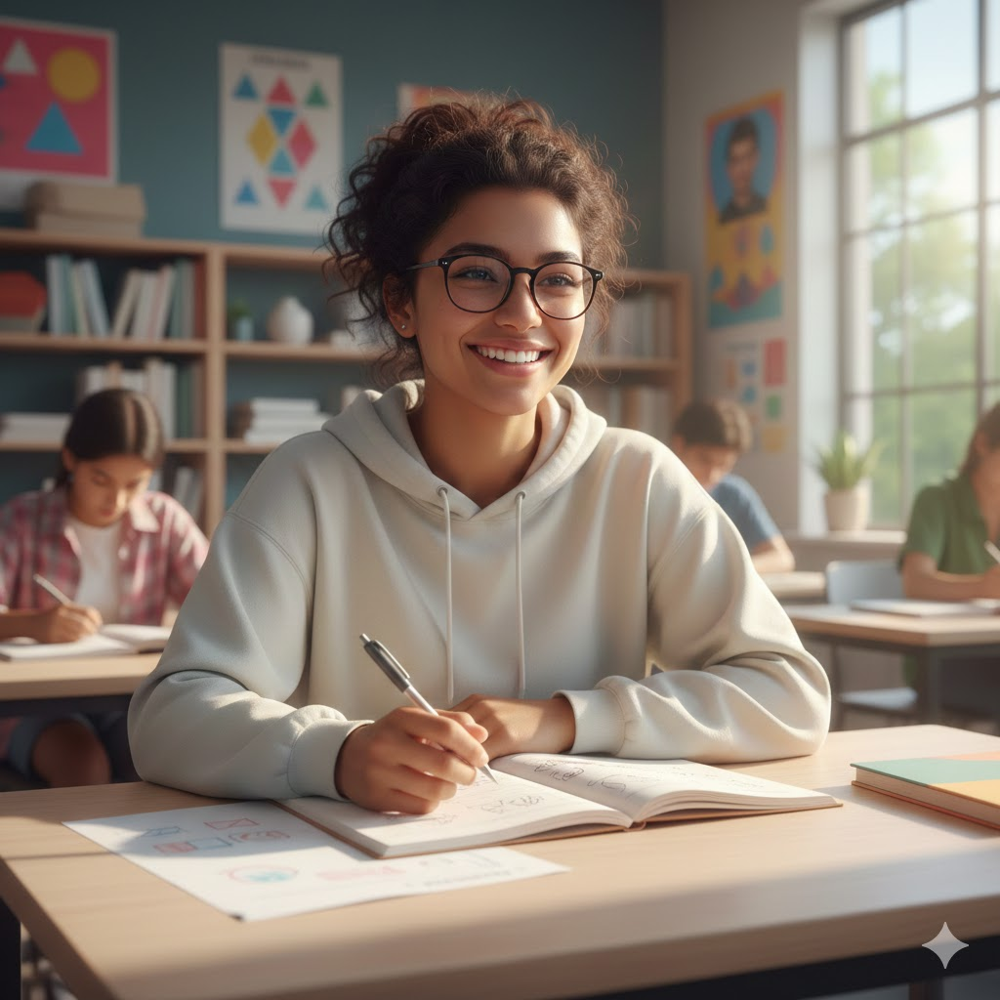

1.     Write a descriptive prompt for an image model (e.g., "A futuristic city skyline at sunset in watercolor style.").

- Prompt: "A happy student at class"

**OUTPUT**:

2. Refine the prompt by adding constraints such as art style, colors, or perspective.

- Prompt: "A student so happy about his result at class in an joyful and emotional manner with tears in his eyes"

**OUTPUT**:

3. Compare results between a vague prompt and a refined descriptive prompt.

The vague prompt gave an image output of a student as the main charater in the class with a blur background i.e less things happening around the student. The descriptive Prompt gave a jofull student who is happy about his result with the whole class cheering him up. It so emotional that his in tears.